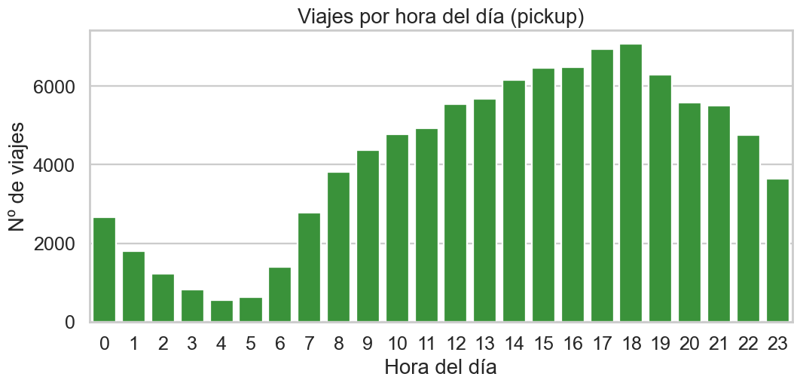
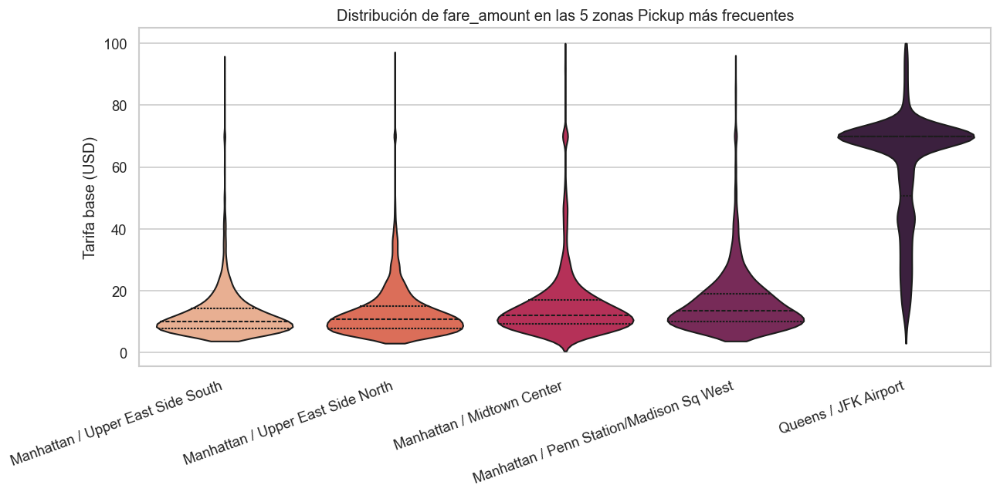
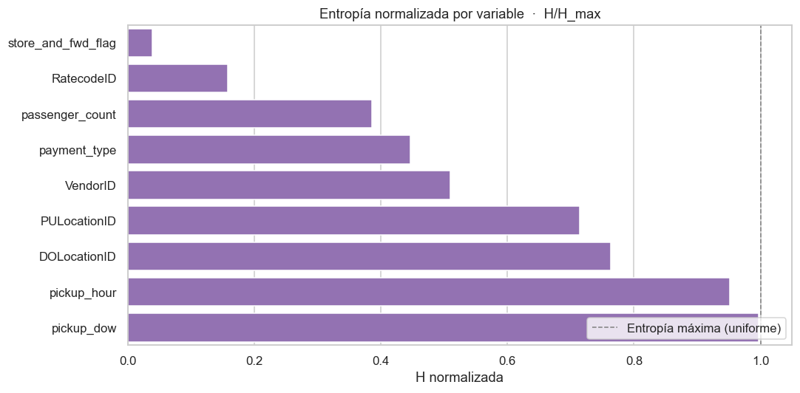
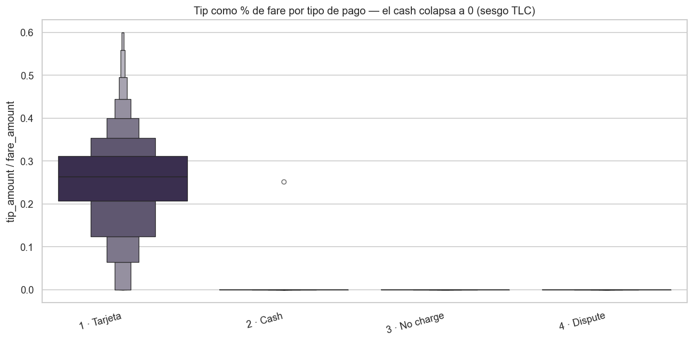

# Slide 1 · Exploración inicial — Características generales

### Dataset
- **Fuente:** TLC · `yellow_tripdata_2024-01.parquet`
- **Universo:** **2 964 624** viajes (48 MB Parquet)
- **Muestra:** 100 000 filas (random, seed=42)
- **Período:** 01–31 Enero 2024
- **Columnas:** 19

### Tipos de datos
- `float64` × 12 (montos, tarifas)
- `int32 / int64` × 4 (IDs, payment_type)
- `datetime64[us]` × 2 (pickup, dropoff)
- `large_string` × 1 (`store_and_fwd_flag`)

### Información clave
- **Temporal:** `tpep_pickup/dropoff_datetime`
- **Geográfica:** `PULocationID`, `DOLocationID` (1–263)
- **Comercial:** `fare`, `tip`, `tolls`, `total`, `Airport_fee`
- **Operacional:** `VendorID`, `RatecodeID`, `payment_type`

### Métricas medias (subset limpio, n=96 455)

| Métrica | Valor real |
|---|---:|
| Duración promedio | **14.96 min** |
| Distancia promedio | **3.28 mi** |
| Tarifa media (`fare_amount`) | **$18.39** |
| Total medio (`total_amount`) | **$27.21** |
| Tip mediana | **$2.79** |

Volumen de viajes por hora (pickup) — pico tarde (16–18 h), valle 3–5 AM.

---

# Slide 2 · Exploración inicial — Top zonas reales

### Top 5 PICKUP (lookup TLC)

| ID | Zona | Viajes |
|---:|---|---:|
| 161 | Manhattan / Midtown Center | 4 895 |
| 132 | **Queens / JFK Airport** | 4 819 |
| 237 | Manhattan / Upper East Side South | 4 734 |
| 236 | Manhattan / Upper East Side North | 4 661 |
| 186 | Manhattan / Penn Station/Madison Sq W | 3 642 |

### Top 5 DROPOFF

| ID | Zona | Viajes |
|---:|---|---:|
| 236 | Manhattan / Upper East Side North | 4 798 |
| 237 | Manhattan / Upper East Side South | 4 356 |
| 161 | Manhattan / Midtown Center | 3 719 |
| 142 | Manhattan / Lincoln Square East | 3 090 |
| 230 | Manhattan / Times Sq/Theatre District | 3 073 |

Distribución de fare en las 5 zonas Pickup más frecuentes. JFK (132) muestra cola pesada hacia $70 (flat rate JFK→Manhattan); el resto se concentra en $5–$25.

**Lectura:** Manhattan domina 9/10 slots; JFK aparece en Pickup pero **no en Dropoff** → patrón asimétrico (turistas que llegan y salen del aeropuerto en taxi, pero entran al aeropuerto por otros modos).

---

# Slide 3 · Desafíos — Calidad de datos

### Inconsistencias detectadas (sobre 100k)

| Inconsistencia | Casos | % |
|---|---:|---:|
| `trip_distance ≤ 0` | 1 991 | 1.99 % |
| `passenger_count = 0` o NaN | 5 812 | 5.81 % |
| `fare_amount ≤ 0` | 1 335 | 1.34 % |
| `total_amount < fare_amount` | 1 241 | 1.24 % |
| pickup fuera de Enero 2024 | 2 | < 0.01 % |

### Nulos coordinados (~4.73 %)
`Airport_fee`, `congestion_surcharge`, `passenger_count`, `RatecodeID`, `store_and_fwd_flag` → **mismas 4 727 filas** (probable formato V1 antiguo del TLC).

### Cardinalidad y entropía

- **263 taxi zones** distintas → preferir lookup oficial sobre one-hot.
- `store_and_fwd_flag` → entropía normalizada **0.04** (95 % "N"): variable casi-constante, baja capacidad informativa por sí sola.
- `RatecodeID` → entropía **0.16** (90 % standard rate): los flat rates (JFK, Newark, negociados) son raros pero financieramente decisivos.
- `pickup_hour` y `pickup_dow` → entropía ~1.0: la demanda se reparte casi uniforme entre días y horas (en granularidad mensual).

Entropía normalizada por variable — `store_and_fwd_flag` y `RatecodeID` ultra-concentradas; las temporales casi uniformes.

---

# Slide 4 · Desafíos — 3 hallazgos clave

### 1 · Tarifas anómalas
**397 viajes (0.40 %)** con `trip_distance < 0.2 mi` y `fare > $50`.
→ Posible **fraude** o **taxímetro atascado**.
**Acción:** flaggear para auditoría; excluir del set de entrenamiento.

### 2 · Duraciones imposibles
**41 viajes** con duración **negativa o > 6 h**.
→ Pickup/dropoff desincronizados o vehículos con meter sin apagar.
**Acción:** clipear duración a `[1, 180] min` antes de modelar.

### 3 · Sesgo de propinas en efectivo
**100 % de los pagos en cash** (`payment_type=2`) reportan `tip = 0`.
→ La **TLC no captura** propinas en efectivo (sesgo estructural).
**Acción:** modelar tipping **solo sobre `payment_type=1`** (tarjeta).

Boxenplot de <code>tip / fare</code> por tipo de pago. Tarjeta (1) tiene mediana ~18 %; cash (2) colapsa a 0.

**Implicancia para el proyecto final:**
Cualquier KPI de tipping reportado sobre el universo completo será **artificialmente bajo** por el ~22 % de pagos en cash. Reportar siempre el ratio de propinas **condicionado al tipo de pago**.

