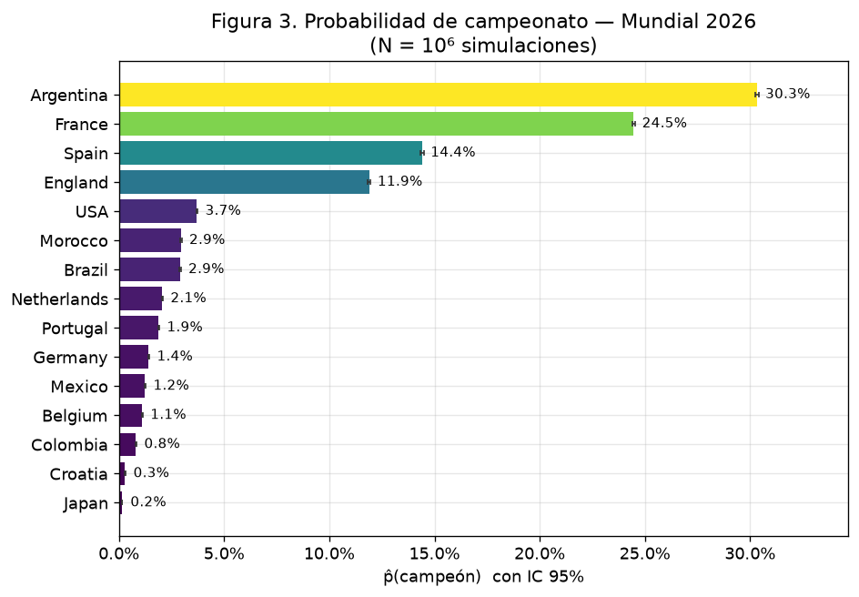
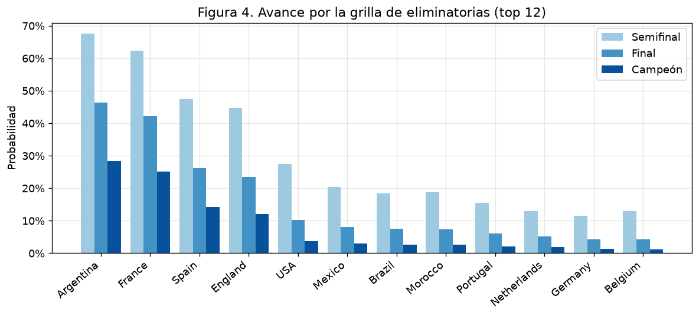
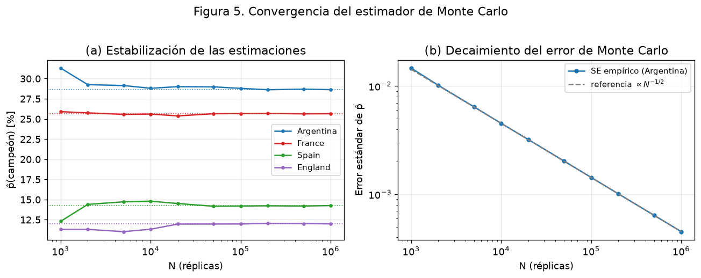
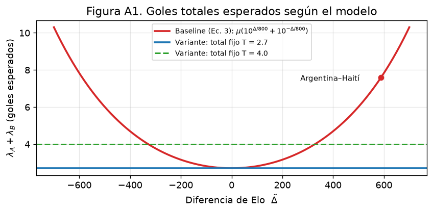
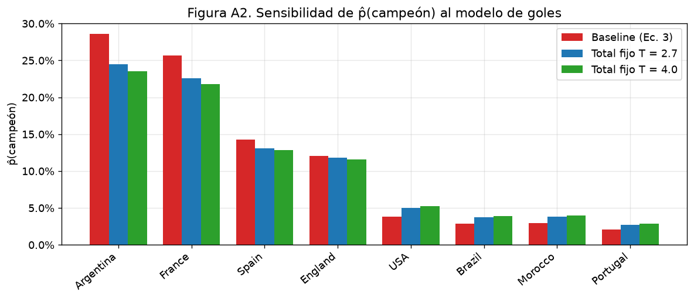
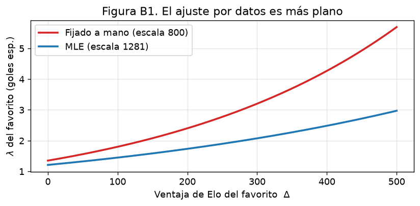
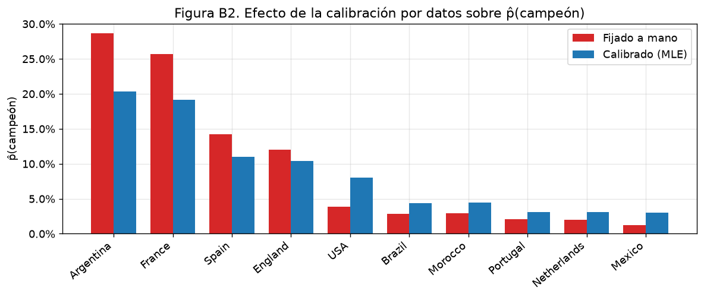
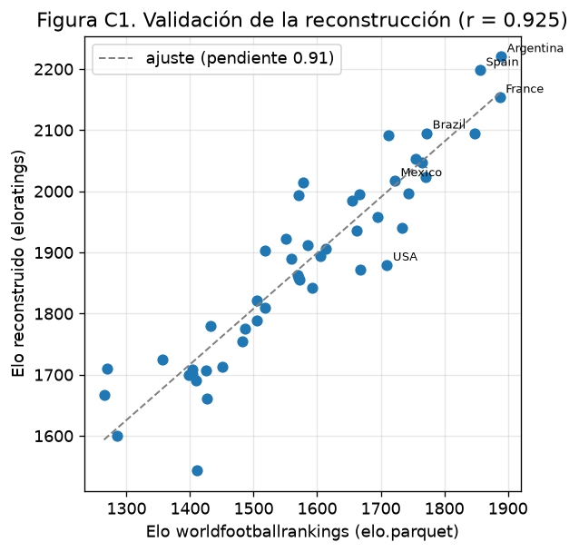
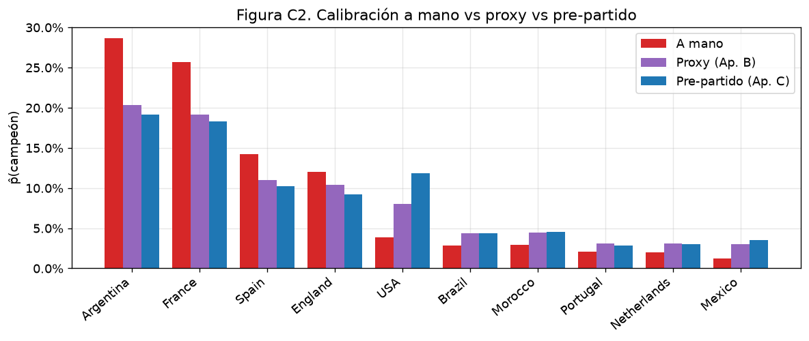
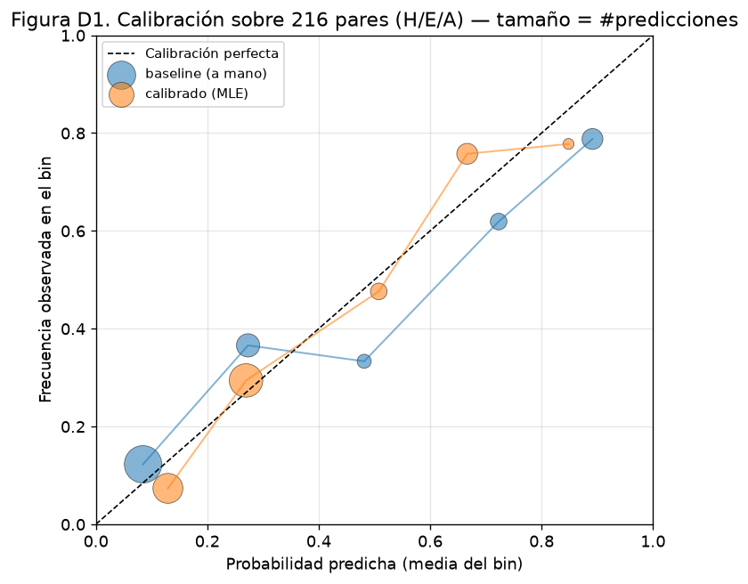

# Mundial 2026 — Simulación Monte Carlo

Simulación de Monte Carlo del **Mundial FIFA 2026** (48 selecciones) que estima
**en cuántos escenarios sale campeona cada selección**, partiendo de:

1. el **ELO** de cada selección, y
2. las **tablas de posiciones actuales** de los 12 grupos (snapshot en curso del torneo).

Se simula miles de veces el resto del torneo (partidos de grupo que faltan +
toda la llave de eliminación) y se cuenta cuántas veces gana cada equipo.

> Solo usa la **biblioteca estándar de Python** (sin numpy/pandas), en línea con
> la filosofía de `montecarlo-calc`.

---

## Uso

Los datos están en **Parquet**, así que el motor requiere `pyarrow` (vía `uv`); se corre con `uv run`:

```bash
uv sync                                  # instala pyarrow (dependencia del motor)
uv run python run.py                     # 20.000 simulaciones (por defecto)
uv run python run.py -n 100000 --seed 2026   # más simulaciones = menos ruido
uv run python run.py -n 50000 --out resultados.parquet --top 30
```

Opciones:

| flag | qué hace | default |
|------|----------|---------|
| `-n, --num`  | cantidad de escenarios simulados | `20000` |
| `--seed`     | semilla del RNG (reproducibilidad) | aleatoria |
| `--base`     | goles esperados base por equipo | `1.35` |
| `--home-adv` | bonus de ELO por localía (sedes USA/México/Canadá) | `60` |
| `--out`      | volcado de resultados (`.parquet` o `.csv` según extensión) | — |
| `--top`      | cuántas selecciones mostrar en pantalla | `20` |

---

## Modelo

**Por partido** se usa un modelo Poisson cuyas medias salen de la diferencia de ELO:

```
λ_A = base · 10^( (ELO_A − ELO_B) / 800 )
λ_B = base · 10^(−(ELO_A − ELO_B) / 800 )
goles_A ~ Poisson(λ_A),   goles_B ~ Poisson(λ_B)
```

Esto hace que el cociente de goles esperados sea `10^(ΔELO/400)` (la forma clásica
del ELO) y mantiene el total de goles aproximadamente constante. Las sedes
(USA, México, Canadá) reciben un bonus de ELO por localía **solo cuando juegan en su
propio país**: en grupos siempre son locales; en la eliminación, la sede de cada partido
está fijada por el calendario oficial (`venue` en `bracket.json`), de modo que un anfitrión
puede jugar fuera de su país (la final y todo desde cuartos se juega en EE. UU.).

**Fase de grupos:** se arranca del estado **actual** (puntos, GF, GA del snapshot) y
se simulan solo los partidos que faltan. El orden final de cada grupo se resuelve por
puntos → diferencia de gol → goles a favor → ELO. Clasifican los 2 primeros de cada
grupo + los **8 mejores terceros**.

**Eliminación directa:** se arma la **Ronda de 32 con la plantilla oficial 2026**
(`data/bracket.json`, M73–M88) y se juega la llave hasta la final (M103). Los 8
terceros se asignan a sus ranuras respetando los grupos admitidos por cada una
(matching bipartito). En la llave, el empate se resuelve por penales con
probabilidad derivada del ELO.

---

## Datos (`data/`) — formato Parquet

| archivo | contenido |
|---------|-----------|
| `elo.parquet`      | ELO de las 48 selecciones (escala de worldfootballrankings; las 48 con dato real al 27-jun) |
| `groups.parquet`   | snapshot de los 12 grupos: partidos jugados, puntos, GF, GA |
| `fixtures.parquet` | partidos de grupo que **faltan** jugar |
| `history.parquet`  | 49.477 partidos internacionales 1872–2026 (calibración; fuente martj42) |
| `played.parquet`   | partidos del Mundial 2026 ya disputados (backtest, Apéndice D) |
| `bracket.json`     | plantilla oficial de la Ronda de 32 y el árbol hasta la final |
| `calibration*.json` | parámetros estimados (Apéndices B y C) |

Los datos canónicos son **Parquet** (lo que lee el código). Las fuentes **editables a mano**
viven en `data/sources/*.csv`; tras editarlas se regeneran los Parquet:

```bash
uv run python convert_to_parquet.py     # data/sources/*.csv + histórico → data/*.parquet
```

Para **actualizar** el Mundial: agregá los resultados nuevos a `data/sources/played.csv` y
corré `reconciliar.py` (reconstruye `groups.csv` y deja en `fixtures.csv` solo lo no jugado,
manteniendo log y tabla siempre consistentes) y luego `convert_to_parquet.py`:

```bash
uv run python reconciliar.py && uv run --extra notebook python convert_to_parquet.py
```

> **Nota:** como Parquet no tiene lector en la biblioteca estándar, el motor `wcsim.py` ahora
> depende de `pyarrow` (antes era stdlib puro). Se corre con `uv run python ...`.

**Fuentes del snapshot (actualizado al 26-jun-2026; fases de grupo A–I completas, J/K/L pendientes):**
tablas de [ESPN](https://www.espn.com/soccer/story/_/id/48939282/2026-fifa-world-cup-fixtures-results-match-schedule-group-stage-knockout-rounds-bracket),
[CBS Sports](https://www.cbssports.com/soccer/news/world-cup-group-standings-table-results/) y
[NBC Sports](https://www.nbcsports.com/soccer/news/2026-world-cup-group-stage-table-full-standings-for-all-12-groups);
ELO de [worldfootballrankings.com](https://worldfootballrankings.com/rankings);
bracket de [worldcuppass.com](https://worldcuppass.com/world-cup-2026-round-of-32/);
histórico de [martj42/international_results](https://github.com/martj42/international_results).

> **Procedencia completa** (cada dataset: origen, licencia, cobertura, datos derivados y
> limitaciones) en **[`data/FUENTES.md`](data/FUENTES.md)**.

---

## Resultado (1.000.000 de escenarios, `--seed 2026`, snapshot 24-jun — los 12 grupos con 2 fechas jugadas; restan las terceras fechas)

| # | Selección | ELO | P(campeón) | P(final) | P(semi) |
|---|-----------|-----|-----------:|---------:|--------:|
| 1 | Argentina | 1889 | **30.1 %** | 49.0 % | 72.5 % |
| 2 | France | 1887 | **24.6 %** | 42.2 % | 60.3 % |
| 3 | Spain | 1856 | **14.0 %** | 25.5 % | 48.4 % |
| 4 | England | 1848 | **12.0 %** | 23.6 % | 44.5 % |
| 5 | USA | 1710 | 3.7 % | 9.9 % | 28.0 % |
| 6 | Morocco | 1770 | 3.0 % | 8.5 % | 21.2 % |
| 7 | Brazil | 1772 | 3.0 % | 8.4 % | 20.4 % |
| 8 | Netherlands | 1764 | 2.1 % | 6.2 % | 14.8 % |
| 9 | Portugal | 1755 | 2.0 % | 5.8 % | 15.6 % |
| 10 | Germany | 1744 | 1.4 % | 4.8 % | 11.9 % |
| 11 | Mexico | 1722 | 1.3 % | 4.9 % | 16.9 % |

En total **34 selecciones** salieron campeonas en al menos un escenario. El detalle
completo de las 48 (campeón / final / semi) está en [`resultados_1M.parquet`](resultados_1M.parquet).
La columna `P(semi)` deja a la vista que la **grilla de eliminatorias completa** (Ronda de
32 → octavos → cuartos → semi → final) entra en el cómputo, no solo la final.

> **Localía geográfica:** la ventaja de sede solo se aplica cuando un anfitrión juega en su
> país. Por eso México (local en R32/octavos pero no en las rondas finales, todas en EE. UU.)
> llega seguido a instancias intermedias —P(semi) ≈ 16 %— pero su P(campeón) cae a ~1.3 %.

---

## Notebook / paper (`mundial2026.ipynb`)

[`mundial2026.ipynb`](mundial2026.ipynb) está redactado como un **paper académico**: resumen,
introducción, datos, metodología formal (ELO, modelo Poisson, estructura del torneo y
**estimador de Monte Carlo con error estándar e intervalos de confianza**), resultados con
**análisis de convergencia** y **de sensibilidad**, discusión, conclusiones y referencias.
Corre **1.000.000 de escenarios** y produce las figuras. Para abrirlo:

```bash
uv sync --extra notebook         # instala matplotlib/pandas/jupyter (solo para el notebook)
uv run --extra notebook jupyter lab mundial2026.ipynb
```

> El **motor** (`wcsim.py`) solo depende de `pyarrow` (lectura de Parquet); matplotlib/pandas/jupyter
> son del extra `notebook`. El entorno queda fijado en `uv.lock`. Para regenerar el notebook desde
> cero: `uv run --extra notebook python _build_notebook.py`.

### Figuras







### Apéndice A — robustez al modelo de goles

El baseline (Ec. 3) prioriza calibrar el ELO, pero como contrapartida los goles totales
**explotan** en partidos desparejos (~7.6 esperados en Argentina–Haití). El apéndice evalúa una
variante con **total de goles fijo** (`MatchModel(total_goals=T)`) que reparte las intensidades
preservando el puntaje esperado del ELO (la diferencia de goles sigue una **Skellam**). Resultado:
el *ordenamiento* de favoritas es robusto, pero las *magnitudes* se mueven —acotar el total
transfiere ~4 pp de Argentina/Francia al pelotón medio—, así que la hipótesis de goles **no es
inocua** y el modelo realista vive entre ambos regímenes (lo fija una calibración tipo Dixon-Coles).





### Apéndice B — calibración por MLE (datos reales)

En vez de fijar `μ`, la escala y `h` a mano, se estiman **de los datos** por máxima verosimilitud:
una **regresión de Poisson** de los goles contra la diferencia de ELO y un indicador de localía
(`log λ = β₀ + β₁·ΔELO + β₂·local`), ajustada sobre 435 partidos internacionales recientes
(≥2023) entre las 48 selecciones. Script: [`calibrate.py`](calibrate.py) → [`data/calibration.json`](data/calibration.json).

```bash
uv run --extra notebook python calibrate.py     # ajusta y escribe data/calibration.json
uv run python run.py -n 1000000 --seed 2026 --calibrated   # 1M con el modelo calibrado
```

| Parámetro | A mano | **MLE** |
|---|---:|---:|
| μ (goles base) | 1.35 | **1.21** |
| escala | 800 | **1281** |
| h (localía, pts ELO) | 60 | **86.7** |

La escala real es **más plana** (~1280 vs 800): el goleo crece con la diferencia de ELO más
lento de lo que asumía el baseline, que por lo tanto **sobreestima a las favoritas**. Con el
modelo calibrado, Argentina pasa de 28.6 % a **~20 %** y Francia de 25.7 % a **~19 %**, con el
pelotón medio (USA, Brasil, Marruecos, México) subiendo. La dirección coincide con el Apéndice A.
*Caveat:* se usa el ELO actual como proxy, lo que atenúa `β₁` (la magnitud es un límite superior).





### Apéndice C — ELO pre-partido reconstruido (calibración sin proxy)

El Apéndice B usó el ELO actual como proxy. Acá se **elimina el proxy**: [`elo_history.py`](elo_history.py)
reconstruye el ELO al momento de cada partido corriendo el algoritmo oficial eloratings
(`R' = R + K·G·(W−We)`) sobre los 49.437 partidos del histórico, y recalibra sobre la diferencia
de ELO **pre-partido** (3.630 partidos, todas las selecciones).

```bash
uv run --extra notebook python elo_history.py   # -> data/elo_reconstructed.parquet + calibration_prematch.json
```

| Parámetro | A mano | Proxy (B) | **Pre-partido (C)** |
|---|---:|---:|---:|
| escala | 800 | 1281 | **1306** |
| h (localía) | 60 | 86.7 | **127** |
| β₁ ± IC95 | — | ±0.00034 | **±0.00007** |

**Hallazgo:** la reconstrucción se valida fuerte contra worldfootballrankings (**r = 0.92**), y al
quitar el proxy **la escala no cambia** (~1306 vs 1281) pero el IC de β₁ se angosta ~5×. O sea: la
dilución de regresión que temíamos era **menor**, y la escala plana —la compresión de las
favoritas— es **robusta, no un artefacto del proxy**. El único cambio material es una localía
estimada mayor (h≈127) que eleva a USA como anfitrión (~12 %).





### Apéndice D — backtest vivo (calidad predictiva por vuelta)

Sobre los partidos del propio Mundial ya disputados se computan las probabilidades $\hat{p}$(H/E/A)
analíticamente con el Elo previo y se contrastan con el resultado real mediante **acierto, Brier
(3-vía) y log-loss**. Es la prueba *fuera de muestra* que cierra el círculo de los Apéndices B/C.
Script: [`backtest.py`](backtest.py) → tablas + figura de calibración (`charts/13_backtest_calibracion.png`).

```bash
uv run python backtest.py                              # tablas (baseline + calibrado)
uv run --extra notebook python backtest.py --plot      # + figura de calibración
```

Sobre las **44 jornadas iniciales** (M1+M2 de A-D, M1+M2 de E-J, M1 de K-L):

| Modelo | Acierto | Brier | logLoss |
|---|---:|---:|---:|
| Uniforme (referencia) | 33 % | 0.667 | 1.099 |
| Frecuencia base | 52 % | 0.606 | 1.009 |
| **Baseline a mano** | **61 %** | **0.502** | **0.848** |
| **Calibrado (MLE, Ap. B)** | **61 %** | **0.497** | **0.845** |

El modelo le saca 0.10 al Brier de la frecuencia base — el contenido del Elo agrega valor real. El
calibrado castiga **menos los empates inesperados** (España 0-0 Cabo Verde: log-loss baja de 3.65
a 2.03), coherente con la **escala más plana** del Apéndice B. Las cinco peores predicciones son
todas empates de favoritos: la independencia Poisson subestima la masa del empate cuando hay
desnivel grande — es exactamente lo que ataca la corrección Dixon–Coles pendiente.



---

## Limitaciones / supuestos

- El ELO es un proxy de fuerza; no modela lesiones, suspensiones ni el estado de forma.
- Goles modelados como Poisson **independientes** (sin correlación ni efecto de marcador).
- La asignación de terceros usa un matching válido respetando los grupos admitidos,
  no la tabla FIFA exacta de 495 combinaciones (efecto de segundo orden sobre el campeón).
- Las 48 selecciones usan ELO real de worldfootballrankings (al 27-jun ya no hay valores estimados; ver `data/FUENTES.md`), con un leve desfase de fecha entre las potencias del snapshot y las 13 actualizadas.
