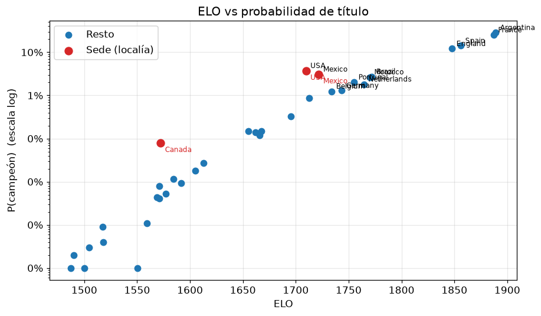

# Mundial 2026 — Simulación Monte Carlo

Simulación de Monte Carlo del **Mundial FIFA 2026** (48 selecciones) que estima
**en cuántos escenarios sale campeona cada selección**, partiendo de:

1. el **ELO** de cada selección, y
2. las **tablas de posiciones actuales** de los 12 grupos (snapshot en curso del torneo).

Se simula miles de veces el resto del torneo (partidos de grupo que faltan +
toda la llave de eliminación) y se cuenta cuántas veces gana cada equipo.

> Solo usa la **biblioteca estándar de Python** (sin numpy/pandas), en línea con
> la filosofía de `montecarlo-calc`.

---

## Uso

```bash
python3 run.py                       # 20.000 simulaciones (por defecto)
python3 run.py -n 100000 --seed 2026 # más simulaciones = menos ruido de muestreo
python3 run.py -n 50000 --out resultados.csv --top 30
```

Opciones:

| flag | qué hace | default |
|------|----------|---------|
| `-n, --num`  | cantidad de escenarios simulados | `20000` |
| `--seed`     | semilla del RNG (reproducibilidad) | aleatoria |
| `--base`     | goles esperados base por equipo | `1.35` |
| `--home-adv` | bonus de ELO por localía (sedes USA/México/Canadá) | `60` |
| `--out`      | CSV con los resultados completos | — |
| `--top`      | cuántas selecciones mostrar en pantalla | `20` |

---

## Modelo

**Por partido** se usa un modelo Poisson cuyas medias salen de la diferencia de ELO:

```
λ_A = base · 10^( (ELO_A − ELO_B) / 800 )
λ_B = base · 10^(−(ELO_A − ELO_B) / 800 )
goles_A ~ Poisson(λ_A),   goles_B ~ Poisson(λ_B)
```

Esto hace que el cociente de goles esperados sea `10^(ΔELO/400)` (la forma clásica
del ELO) y mantiene el total de goles aproximadamente constante. Las sedes
(USA, México, Canadá) reciben un bonus de ELO por localía.

**Fase de grupos:** se arranca del estado **actual** (puntos, GF, GA del snapshot) y
se simulan solo los partidos que faltan. El orden final de cada grupo se resuelve por
puntos → diferencia de gol → goles a favor → ELO. Clasifican los 2 primeros de cada
grupo + los **8 mejores terceros**.

**Eliminación directa:** se arma la **Ronda de 32 con la plantilla oficial 2026**
(`data/bracket.json`, M73–M88) y se juega la llave hasta la final (M103). Los 8
terceros se asignan a sus ranuras respetando los grupos admitidos por cada una
(matching bipartito). En la llave, el empate se resuelve por penales con
probabilidad derivada del ELO.

---

## Datos (`data/`)

| archivo | contenido |
|---------|-----------|
| `elo.csv`      | ELO de las 48 selecciones (escala clásica de worldfootballrankings; los equipos sin dato público están marcados `estimado`) |
| `groups.csv`   | snapshot de los 12 grupos: partidos jugados, puntos, GF, GA |
| `fixtures.csv` | partidos de grupo que **faltan** jugar |
| `bracket.json` | plantilla oficial de la Ronda de 32 y el árbol hasta la final |

Para **actualizar** la simulación a medida que avanza el Mundial: editá `groups.csv`
(puntos/goles) y sacá de `fixtures.csv` los partidos ya jugados. El modelo se adapta solo.

**Fuentes del snapshot (≈ 20-jun-2026):** tablas de [CBS Sports](https://www.cbssports.com/soccer/news/world-cup-group-standings-table-results/)
y [NBC Sports](https://www.nbcsports.com/soccer/news/2026-world-cup-group-stage-table-full-standings-for-all-12-groups);
ELO de [worldfootballrankings.com](https://worldfootballrankings.com/rankings);
bracket de [worldcuppass.com](https://worldcuppass.com/world-cup-2026-round-of-32/).

---

## Resultado (1.000.000 de escenarios, `--seed 2026`)

| # | Selección | ELO | P(campeón) | P(final) | P(semi) |
|---|-----------|-----|-----------:|---------:|--------:|
| 1 | Argentina | 1889 | **28.3 %** | 46.4 % | 67.5 % |
| 2 | France | 1887 | **25.0 %** | 42.2 % | 62.3 % |
| 3 | Spain | 1856 | **14.1 %** | 26.2 % | 47.5 % |
| 4 | England | 1848 | **12.1 %** | 23.4 % | 44.6 % |
| 5 | USA | 1710 | 3.7 % | 10.2 % | 27.4 % |
| 6 | Mexico | 1722 | 3.1 % | 8.1 % | 20.3 % |
| 7 | Brazil | 1772 | 2.7 % | 7.5 % | 18.4 % |
| 8 | Morocco | 1770 | 2.7 % | 7.4 % | 18.7 % |
| 9 | Portugal | 1755 | 2.0 % | 6.0 % | 15.5 % |
| 10 | Netherlands | 1764 | 1.8 % | 5.2 % | 12.9 % |

En total **35 selecciones** salieron campeonas en al menos un escenario. El detalle
completo de las 48 (campeón / final / semi) está en [`resultados_1M.csv`](resultados_1M.csv).
La columna `P(semi)` deja a la vista que la **grilla de eliminatorias completa** (Ronda de
32 → octavos → cuartos → semi → final) entra en el cómputo, no solo la final.

> USA y México aparecen por encima de su ELO puro por la **ventaja de localía** y por
> estar ya primeros de grupo (llave más favorable en la Ronda de 32).

---

## Notebook (`mundial2026.ipynb`)

[`mundial2026.ipynb`](mundial2026.ipynb) explica paso a paso la **lógica del ELO**, la
**lógica de la simulación** (modelo de partido, fase de grupos y grilla de eliminatorias),
corre **1.000.000 de escenarios** y produce los gráficos. Para abrirlo:

```bash
uv sync --extra notebook         # instala matplotlib/pandas/jupyter (solo para el notebook)
uv run --extra notebook jupyter lab mundial2026.ipynb
```

> El **motor** (`wcsim.py`) sigue siendo stdlib puro; estas dependencias son solo para la
> presentación. Para regenerar el notebook desde cero: `uv run --extra notebook python _build_notebook.py`.

### Gráficos




---

## Limitaciones / supuestos

- El ELO es un proxy de fuerza; no modela lesiones, suspensiones ni el estado de forma.
- Goles modelados como Poisson **independientes** (sin correlación ni efecto de marcador).
- La asignación de terceros usa un matching válido respetando los grupos admitidos,
  no la tabla FIFA exacta de 495 combinaciones (efecto de segundo orden sobre el campeón).
- Algunos ELO de selecciones menores están **estimados** (ver columna `fuente` en `elo.csv`).
